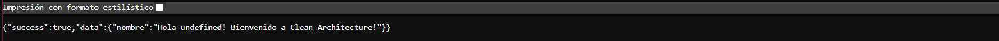

royecto Tarea Web 2 - Clean Architecture

## 👥 Equipo y Plan de Acción
* **Benjamín Fernández:** Creó el README.md y la capa `domain` inicial como también infraestructure.
* **Matías Díaz:** Inicializó configuraciones (TypeScript, package.json) y creó la capa `application` (Casos de Uso).
* **Bastián Pizarro:** Creó la capa de adaptadores/interfaces HTTP (Controladores y Rutas).

---

## 🏗️ Arquitectura del Proyecto (Clean Architecture)

El proyecto está construido usando **Node.js y TypeScript** aplicando los principios de la **Arquitectura Limpia** (Clean Architecture). El objetivo es tener un código altamente mantenible, escalable y en donde la lógica de negocio no dependa de librerías externas o frameworks.

### Estructura de Carpetas

```text
TAREA/
├── docs/
│   └── exito.png
│
└── src/
    ├── application/                    # CAPA: Casos de Uso
    │   ├── ports/
    │   │   └── IMessageRepository.ts  ← Contrato/interfaz del repositorio
    │   └── use-cases/
    │       └── holaMundo.ts           ← Caso de uso principal
    │
    ├── domain/                         # CAPA: Entidades del Negocio
    │   └── entities/
    │       └── Message.ts             ← Entidad pura sin dependencias
    │
    ├── infrastructure/                 # CAPA: Detalles Técnicos
    │   └── server/
    │       └── app.ts                 ← Configuración del servidor Express
    │
    ├── interfaces/                     # CAPA: Adaptadores HTTP
    │   └── http/
    │       └── controllers/
    │           └── holaMundoController.ts  ← Recibe Request, devuelve Response
    │
    └── index.ts                        ← Punto de entrada de la aplicación

### ¿Por qué esta estructura?
1. **Independencia de Frameworks:** La arquitectura no depende de si usamos Express, Fastify, etc.
2. **Independencia de la Interfaz de Usuario:** La interfaz web puede cambiar por otra consola sin alterar las reglas del negocio.
3. **Independencia de la Base de Datos:** Puedes intercambiar bases de datos porque la lógica del negocio está conectada solo a *Interfaces*.
4. **Fácil de testear:** Las reglas de negocio se pueden probar sin servidor web y sin base de datos real.

---

## 🚀 Guía de Instalación y Uso

### 1. Requisitos Previos
* [Node.js](https://nodejs.org/) instalado.
* TypeScript instalado a nivel de proyecto (`npm install typescript @types/node --save-dev`).

---

## ✅ Ejecución del Proyecto

### Instalar dependencias:
```bash
npm install
```

### Ejecutar el servidor:
```bash
node src/index.js
```

El servidor se iniciará en `http://localhost:3000`

### Prueba exitosa:
Accede a la siguiente URL en tu navegador o cliente HTTP:
```
http://localhost:3000/?nombre=TuNombre
```

**Respuesta esperada:**
```json
{
  "success": true,
  "data": {
    "nombre": "Hola TuNombre! Bienvenido a Clean Architecture!"
  }
}
```



### 2. Instalación
Dentro de la carpeta del proyecto instala las dependencias:
```bash
npm install
```

### 3. Compilación
Para transpilar el código TypeScript a JavaScript en una carpeta de distribución (típicamente `dist/` o `build/`), utiliza:
```bash
npx tsc
```
